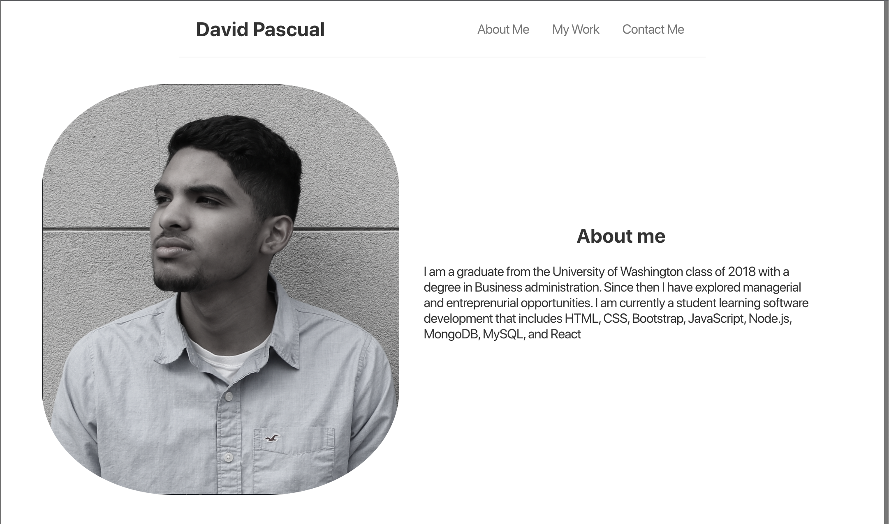
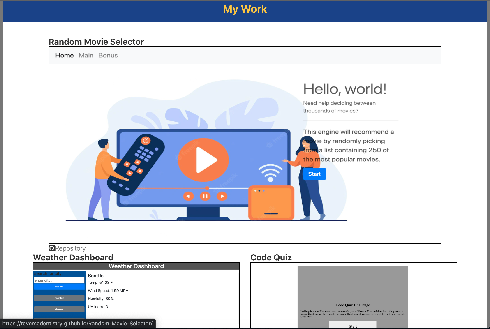
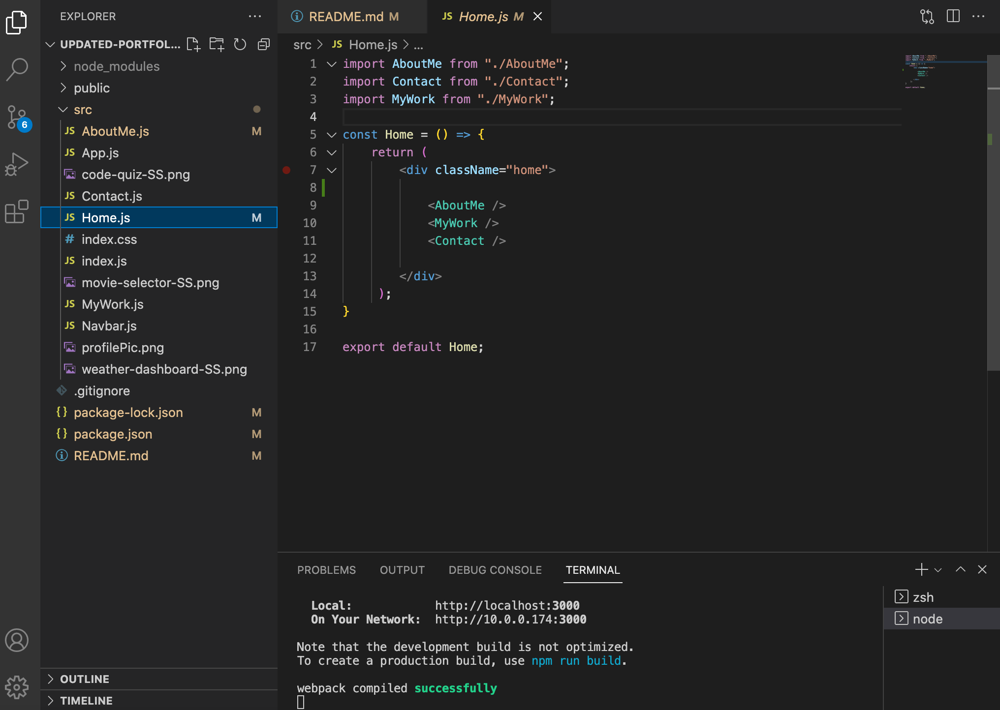

## React-Portfolio

## Description
This is my Portfolio that is powered by React.js. This app uses components for each seaction of the protfolio rather than having using the standdard HTML page with the linked Javascript file.  

## Technologies
* React
* JSX
* Bootstrap
* Node.js
* Javascript

## Installation
`npm i`

`npm start`

## Usage
in order to run this application you must install React by typing 
`npx create-react-app [insert name here]`

once complete you can than start the server by typing:
`npm start`

## Available Scripts

In the project directory, you can run:

### `npm start`

Runs the app in the development mode.\
Open [http://localhost:3000](http://localhost:3000) to view it in your browser.

The page will reload when you make changes.\
You may also see any lint errors in the console.

### `npm test`

Launches the test runner in the interactive watch mode.\
See the section about [running tests](https://facebook.github.io/create-react-app/docs/running-tests) for more information.

### `npm run build`

Builds the app for production to the `build` folder.\
It correctly bundles React in production mode and optimizes the build for the best performance.

The build is minified and the filenames include the hashes.\
Your app is ready to be deployed!

See the section about [deployment](https://facebook.github.io/create-react-app/docs/deployment) for more information.

## Preview

## Author
- GitHub: davidpascual2
- Email: davidpascual200@gmail.com